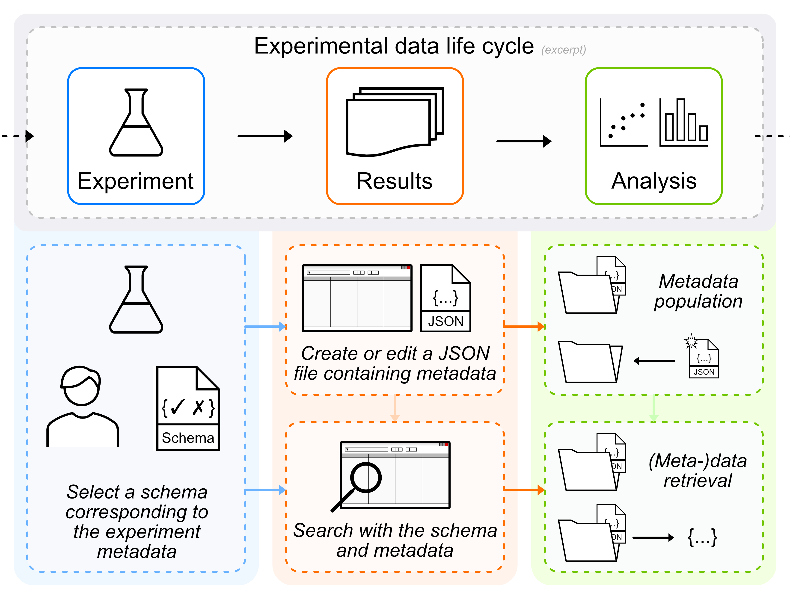

# Summary

With the emergence of ever-increasing size of data and metadata sets in science, there is a need for development of robust, reliable and reproducible methods and workflows supporting researchers managing their data. The successful tracking and storage of metadata has become increasingly important in recent years, evolving from paper-based notation to computer-assisted collection and storage utilising modern, scalable and flexible approaches and techniques. However, despite several interoperable and supportive standard data formats and a lot of recently developed tools, the collection and maintenance of data and metadata remains a lengthy and complicated process. Not only because of the challenge of vendor-dependent, non-standard data formats and complex datasets, but also because of the different needs in the course of laboratory work, reflected in different experimental setups, internal and external conditions, or equipment used and installed, even in the same laboratories. 

We therefor propose the "pyJSON Schema Loader and JSON Editor" (currently located at [https://github.com/nplathe/pyJSON-Schema-Loader-and-JSON-Editor](https://github.com/nplathe/pyJSON-Schema-Loader-and-JSON-Editor)), a client-side desktop application for offline and local environments capable of creating and editing metadata-containing JSON documents on the basis of JSON Schemas. It also has a utility tool integrated in order to track and search directories containing said JSON documents. It is written in Python, a modern and flexible language, and features a lightweight user interface for editing and managing JSON files. The custom JSON schemas used in the creation process of JSON documents are stored in a dedicated directory, with common features of the JSON schema standard supported. The interface consists of a table-like view, which is a view most users are familiar with. This table-like structure is tailored to present JSON documents, enriched with information from the corresponding JSON schema, if present, adding in descriptions and proper titles for each key.

This presented tool shall assist in creating and maintaining documents containing metadata by simplifying the process of generation and editing based on a given schema. It may be used to document data sets, data collections and/or devices in a local file structure. The built-in search functionality supports findability in more complex directory structures. The tool is intended to support the aforementioned transition from paper-based documentation to more modern research data management workflows, while sustaining a uniform and standardised structure, without the need to bind users to an often complex and resource demanding database system.

# Statement of need

The well-known FAIR principles [@Wilkinson:2016] were introduced with the intention to make data sets more sustainable in being findable, accessible, interoperable and reusable, hence the acronym. However, while the FAIR principles inspired a plethora of tools and toolchains attempting to support scientists in their work, the adaption of those tools and guidelines in compliance with the requirements to the dataset structures featured in experiments and analysis is only slowly advancing and requires further developed software tailored to better enrichment of data with the corresponding metadata[@Jeffery:2021]. While usability and immediate benefits usually are core of concerns, so is the need of a high amount of flexibility and demand of domain specific functionalities and individual needs [@Israel:2023], especially when vastly differing table-top experiments are utilised or clinical studies are performed. While more sophisticated research data management (RDM) solutions, may it be a domain-specific repository system, an eletronic lab notebook (ELN) or semi automated pipelines of data and metadata acquisition, are powerful and flexible, end users are often overwhelmed with technical details, when these tools are implemented into common workflows. Furthermore, while extended metadata collection is often needed, supporting the collection of metadata remains a challenging task for both researchers and data analysts. A common situation in which the mentioned issues are present is the annotation of historical data of a large amount of experimental data that cannot be properly automated. Also, while database approaches are common for storage of large datasets, sometimes utilisation is discouraged due to various factors and situations or lacking proper interfaces that are easy to use, which is, why researchers are then left with organisation on a file system level.

The "pyJSON Schema Loader and JSON Editor" attempts to mitigate these issues by letting users create and manage metadata on a file system base with a simple-to-use user interface. It utilises JSON schema to support creation of a valid JSON document by generation of a blank tree to be filled with values. Said tree is represented in a tabular structure, which is well-known by even less technically trained personnel, which lowers the entry barrier to modern RDM. This is crucial, as a high entry barrier might prevent RDM utilities from adoption. Our tool uses the schema information and the typisation of the document to ensure valid information is entered, which makes the process less error prone. The tool also offers an option to store entered information as a default template for a selected schema, which eases entering repetitive information. A search function utilising an indexer and information entered into the table further supports metadata management. It is intended to use "pyJSON" to support the metadata acquisition and storage of experimental data of laser induced plasma formation in water [@libs60:2020libs60], which is a large amount of mostly offline acquired smaller data sets.

It shall be noted that there are also other editors or form generators based on JSON schema, mostly web-based, e.g., *JSON Forms* [@jsonformsio:2023jsonformsio], *JSON Form* [@joshfire:2023jsonform], *JSON Editor* @json-editor:2023json-editor. While they make use of the schemas to generate simple form interfaces in the browser and are highly versatile, their interaction with the user requires technical expertise and their integration would have been featuring a lot of additional work, as they lack specific functionality to quickly save, load, edit and track JSON documents on local harddrives, which is the intended use for pyJSON. Also, without being wrapped into an application framework, a browser and an internet connection would have been necessities, which is a crucial issue in labs lacking internet access. There are also research focused databases and repositories to be found, like *Dendro* [@RochadaSilva:2014dendro], *Coscine* [@Politze:2020coscine] and *Kadi4Mat* [@Brandt:2021kadi4mat]. Opposing the document-focused approach of "pyJSON", these tools provide large scalability server side solutions in order to manage, share and organise large data sets and projects, with varying concepts and workflows. While that might be a preferrable solution for larger projects or collaborative works, those platforms might be too overwhelming for first insight data sets and small-scale experiments. They also have the issue of offline work not being easily possible and are by no means usable out-of-the-box. 

# Implementation and Features
The "pyJSON Schema Loader and JSON Editor", which is presented here, is created for two major situations - the creation of schema-compliant JSON documents based on a custom JSON schema and provision of a utility, that is capable of searching JSON documents containing metadata via the used schema and entered search terms.  
When exchanging structured data that is machine and human readable, very popular choices are "YAML ain't markup language" (YAML) [@yaml:2021yaml] and "JavaScript Object Notation" (JSON) [@bray:2017json], they are versatile, fulfil the readability requirement, feature a simple syntax and yet are capable of representing complex metadata structures. The implementation and verification of entered information via so-called schemas enables a generic support for various use cases, while still providing a framework for robust, validatable and reliable metadata acquisition. For "pyJSON", as the name implies, it was decided to work with JSON, mainly, because of the wide usage in web technologies, the broad compatibility with other tools, including other RDM focused software, and the JSON Linked Data extension (JSON-LD) [@jsonld:2023jsonld], which enables schemas featuring knowledge-based organisation and annotation.

{ width=85% }

\autoref{fig:pyJSON_use_case} shows the two main usage applications in an experimental workflow context. The two goals - creation of metadata-containing files and search of metadata within data sets - are archived through the same user interface. However, in order to use our tool, JSON schemas need to be supplied first, either by creating a schema from scratch or by acquiring a sufficient schema from another source. Through the usage of the aforementioned JSON schemas, "pyJSON" is a generic tool suitable for different fields of research or work. After selection of the schema to be added, it gets copied into a directory managed by the tool, to avoid conflicts induced by missing or changed schemas. Also, in order to be fully operational, the user is expected to select the proper schema in the tool first.

After selecting the appropriate schema, the user can open a JSON document or create a new document using the schema as a base. If creating a new document, "pyJSON" utilises standard python libraries to parse the schema into a nested python dictionary and constructs a skeleton structure from it. It then generates a tree-like structure based on the abstract item model class `QAbstractItemModel` that is featured in the Qt library. Otherwise, if a JSON document is loaded, the JSON contents are used as a backbone for the tree model instead and data types are then implied by the JSON document instead of the JSON schema. This process does not necessarily need a schema, however, it is more convenient to have a proper schema at hand. Note that, while the structure is correctly represented, errors for missing information might be shown.

That model class and the items class allow for being represented in a widget called `QTreeView`, which acts as a table-like frontend for said tree model. Information is presented to the user in five columns - "JSON Structure", "Title", "Value", "Type" and "Description", with title and description dependent on the schema and the other columns extracted from the JSON document currently loaded or the schema, from which a blank document got created. Only the value column is generally editable. With QT featuring a model-view concept, special edit methods can be provided for specific fields to be edited, e.g. a drop-down menu instead of a text field for enumerated values. While entering information, the data type and potential attributes are used to validate the input. When saving edits, the structure and the values get converted back to a nested python dictionary and then to a JSON document, which gets validated against its schema before saving. It is also possible to save a partly filled JSON - standard values are then inserted. Note, however, that validation is then dependent on the schema's constraints.

A search functionality supports organisation of data on a file system base. The tool is capable of indexing directory trees and utilise them to search through JSON documents via schema validation and entering keywords into the selected schema. Found JSON documents can then directly be opened in "pyJSON", paths to the JSON files can also be accessed with the file manager software of the used operating system (currently Microsoft Windows™ only).

Currently, the "pyJSON Schema Loader and JSON Editor" contains the following features:

* Reading, editing and writing of JSON documents.
* Generation of an empty JSON based on a selected JSON schema containing common keywords.
* Validation of the JSON document and of entered information while editing.
* Local storage for JSON schemas and template JSON documents.
* Indexing and searching directories via JSON schema and entered values.

Starting from these already implemented features, "pyJSON" will be improved on the basis of internal and external user feedback and issue reports. While there is support for the most common keywords, "pyJSON" lacks support for rarer, but still viable options that further support information validation, such as regular expression matching for strings, minimum and maximum for numerical values and several options for arrays of values. It also serves as a precursor to further implement advanced workflows and technologies.

# Acknowledgements

The work was funded by "Deutsche Forschungsgemeinschaft (DFG)" - Projektnummer 454848899 and by the German Federal Ministry of Education and Research (BMBF) under the grant mark 16QK03A. The responsibility for the content of this repository lies with the authors.

# References